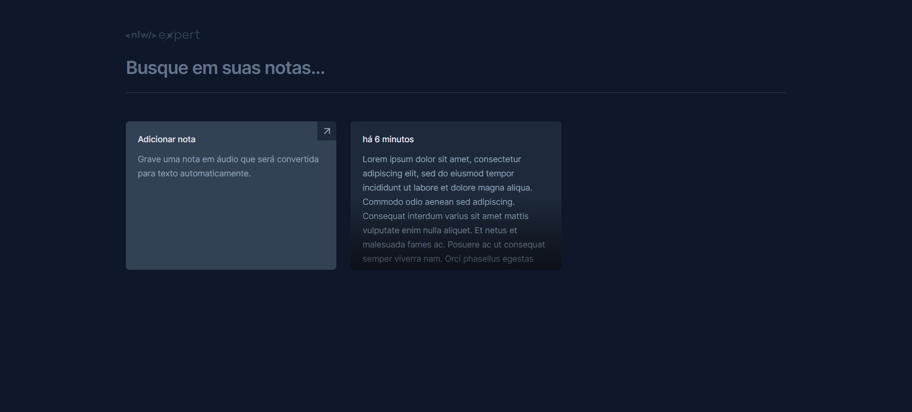
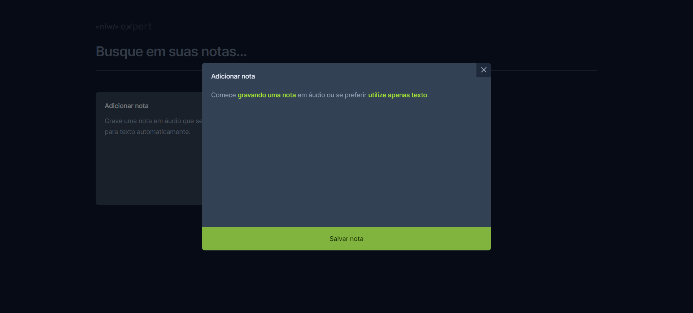
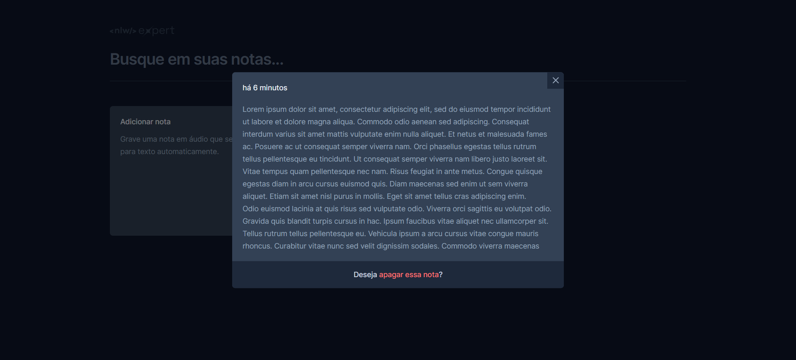

Eae, Dev! 👊🏾

Seja bem vindo(a) ✨🚀

<h1 align="center">📝 Expert Notes 📝</h1>
<h3 align="center">Next Level Week (NLW) - Rocketseat</h3>

  <a href="#-sobre">Sobre</a>&nbsp;&nbsp;&nbsp;|&nbsp;&nbsp;&nbsp;
  <a href="#-tecnologias">Tecnologias</a>&nbsp;&nbsp;&nbsp;|&nbsp;&nbsp;&nbsp;
  <a href="#-layout">Layout</a>&nbsp;&nbsp;&nbsp;|&nbsp;&nbsp;&nbsp;
  <a href="#-licença">Licença</a>&nbsp;&nbsp;&nbsp;|&nbsp;&nbsp;&nbsp;
  <a href="#-acesse-o-rocketseat-one">Acesse o Rocketseat One</a>

  

<h3>📌 Sobre</h3> 

O evento NLW Expert é um evento gratuito, ministrado pela [Rocketseat](https://www.rocketseat.com.br/), que veio trazendo várias possibilitades de projeto, em diferentes tecnologias, codando os mesmos de forma completa, introduzindo e aplicando conceitos muito importantes a nível de mercado.  
O projeto Expert Notes foi desenvolvido por meio da trilha React e nele vamos aplicar conceitos fundamentais do ReactJS, construindo uma aplicação de notas, que implementa a API SpeechRecognition, nativa de alguns navegadores, possibilitando escrever notas por voz!

<h3>📌 Tecnologias e bibliotecas</h3> 

- [ReactJS](https://pt-br.react.dev/)
- [TypeScript](https://www.typescriptlang.org/)
- [Tailwind CSS](https://tailwindcss.com/)
- [Vite](https://vitejs.dev/)
- [Sonner](https://sonner.emilkowal.ski/)
- [Lucide](https://lucide.dev/) 
- [Date FNS](https://date-fns.org/)
- [Radix UI](https://www.radix-ui.com/)
- [SpeechRecognitionAPI](https://developer.mozilla.org/en-US/docs/Web/API/SpeechRecognition)
- [Git](https://git-scm.com/)
- [Figma](https://figma.com)

<h3>📌 Layout</h3>

Você pode visualizar o layout do projeto através [DESSE LINK](https://www.figma.com/community/file/1336456128647909148). É necessário ter conta no [Figma](https://figma.com) para acessá-lo.

<h3>📌 Licença</h3>

Esse projeto está sob a licença MIT.

<h3>📌 Acesse o Rocketseat One</h3>

[Rocketseat One](https://app.rocketseat.com.br/cart/rocketseat-one?referral=willian-moreno&utm_source=platform&utm_medium=organic&utm_campaign=venda&utm_term=mgm&utm_content=indication-lp_one)
